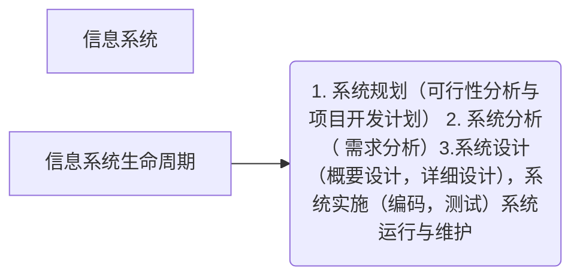
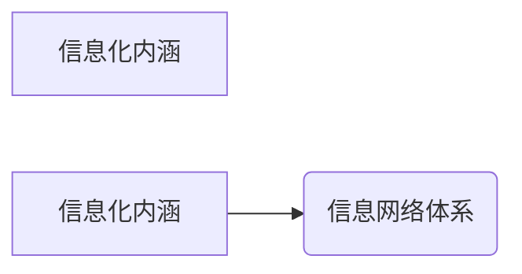
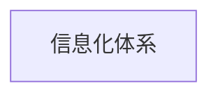
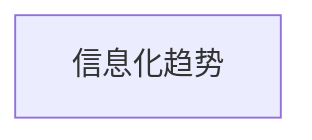

## 信息化发展

### 信息

- 信息是物质，能量及其属性的标示的集合，是确定性的增加

1. **特征**

   - 客观性
   - 普遍性
   - 无限性
   - 动态性
   - 相对性
   - 依附性
   - 变换性
   - 传递性
   - 层次性
   - 系统性
   - 转化性

2. **质量属性**

   - 精确性
   - 完整性
   - 可靠性
   - 及时性
   - 经济性
   - 可验证性
   - 安全性

- 应用场景不同，信息的侧重面也不同
  - 金融信息：最重要的是安全
  - 经济与社会信息：最重要的是及时性

### 信息系统

#### 信息系统及其特征

信息系统是输入数据，通过加工处理，产生信息的系统

### 信息化

